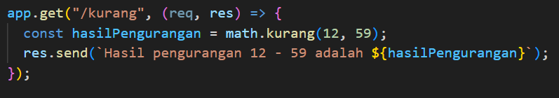

# Assignment: Express.js & Modul Node.js

## Identitas
- **Nama** : Ajeng Sakinah Wulandari
- **NIM** : F1D022001
- **Kelas**: Pemrograman Web Lanjut B

## Deskripsi Tugas
Tugas ini bertujuan untuk membangun sebuah server Express.js yang memiliki beberapa endpoint (rute).
1.  Membuat modul `utils/math.js` yang berisi fungsi-fungsi matematika (penjumlahan, pengurangan, perkalian, pembagian, dan modulus) yang diekspor untuk digunakan di file utama.
2.  Memisahkan rute yang berkaitan dengan profil ke dalam file `routes/profil.js` untuk menjaga agar kode di `index.js` tetap bersih dan terorganisir.

## Hasil
Berikut adalah hasil screenshot dari setiap endpoint yang telah dibuat:

### 1. Route Utama (`/`)
Menampilkan nama dan NIM mahasiswa, yaitu `Ajeng Sakinah Wulandari` dengan NIM `F1D022001`.
**URL**: `GET http://localhost:3000/`

\nPada kode tersebut pengguna menggunakan metode `GET` untuk mengakses root URL dan server akan memberikan balasan `res` berupa string nama dan NIM.

### 2. Route Hitung
a. Menampilkan hasil penjumlahan yang diambil dari fungsi `tambah()` pada modul `math.js`.
**URL**: `GET http://localhost:3000/tambah`

\nPada kode ini mendefinisikan sebuah route GET pada endpoint `/tambah`. Ketika diakses, server akan memanggil fungsi `tambah()` untuk menghitung 37 + 84, lalu mengembalikan hasil penjumlahan tersebut sebagai respon.

b. Menampilkan hasil pengurangan yang diambil dari fungsi `kurang()` pada modul `math.js`.
**URL**: `GET http://localhost:3000/kurang`

\nPotongan kode ini membuat route GET pada endpoint `/kurang`. Saat diakses, server akan menjalankan `kurang()` untuk menghitung 12 - 59, lalu mengirimkan hasil pengurangan tersebut sebagai respon.

c. Menampilkan hasil perkalian yang diambil dari fungsi `kali()` pada modul `math.js`.
**URL**: `GET http://localhost:3000/kali`

\nKode ini membuat route GET pada endpoint `/kali`. Saat diakses, server akan menjalankan `kali()` untuk menghitung 46 * 73, lalu mengirimkan hasil perkalian tersebut sebagai respon.

d. Menampilkan hasil pembagian yang diambil dari fungsi `bagi()` pada modul `math.js`.
**URL**: `GET http://localhost:3000/bagi`

\nKode di atas membuat route GET pada endpoint `/bagi`. Saat diakses, server akan menjalankan `bagi()` untuk menghitung 5 / 91, lalu mengirimkan hasil pembagian tersebut sebagai respon.

e. Menampilkan hasil modulus yang diambil dari fungsi `modulus()` pada modul `math.js`.
**URL**: `GET http://localhost:3000/mod`

\nPada kode di atas membuat route GET pada endpoint `/mod`. Saat diakses, server akan menjalankan `modulus()` untuk menghitung 28 % 64, lalu mengirimkan hasil modulus tersebut sebagai respon.

### 3. Route Semua Profil (`/profil`)
Menampilkan semua data profil dalam format JSON array.
**URL**: `GET http://localhost:3000/profil`

\nJika server di jalankan dan mengakses URL tersebut akan memicu router yang sudah didefinisikan di `routes/profil.js` untuk mengirimkan data dari `profil.js` dalam bentuk JSON array sebagai respon.

### 4. Route Profil Detail (`/profile/:nim`)
Menampilkan detail salah satu profil berdasarkan NIM yang diberikan sebagai parameter URL.
**URL**: `GET http://localhost:3000/profile/F1D022001`

\nGambar di atas menunjukkan bahwa profil dengan NIM F1D022001 ada di dalam array `profiles` sehingga server bisa mengembalikkan data profil tersebut dalam bentuk array JSON.

**URL**: `GET http://localhost:3000/profile/F1D022233`

\nGambar di atas menunjukkan bahwa profil dengan NIM F1D022233 **tidak ada** di dalam array `profiles` sehingga server mengembalikkan keterangan bahwa data dengan NIM tersebut tidak ada di dalam array.

**URL**: `GET http://localhost:3000/profile/W1S021999`

**URL**: `GET http://localhost:3000/profile/G1A025021`
